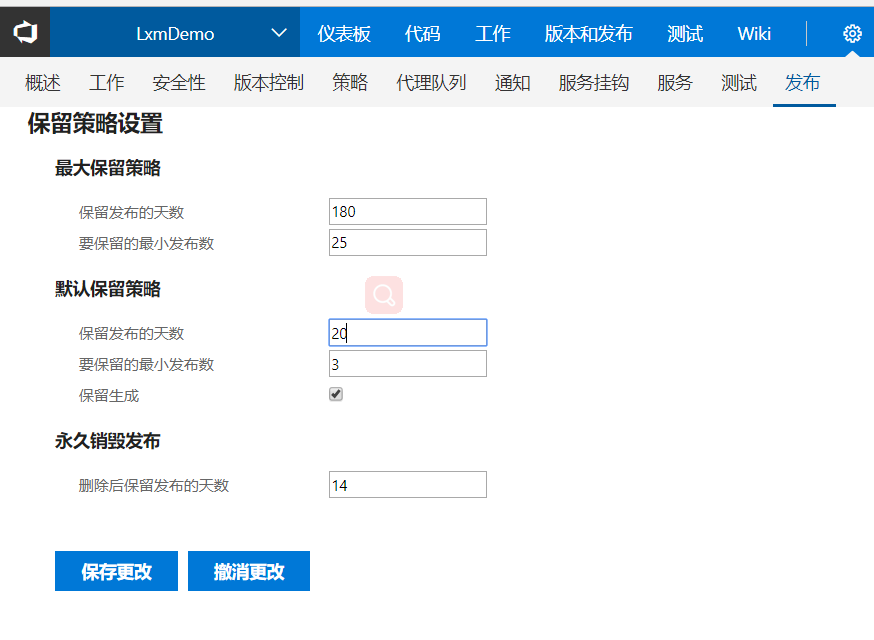
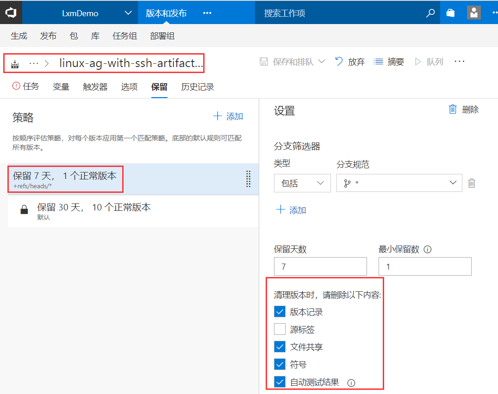

#TFS优化

背景
====

在使用TFS的过程中，了解一些小技巧和实践，可以让TFS具有更好的访问性能，也更易于维护。比如有时候会发现数据库占用的空间快速增长，对存储成本较敏感的企业可能会比较在意这方面的问题。随着对TFS的使用，用户规模和团队项目规模也会慢慢变大，有时访问TFS是明显感觉比较慢，占用的存储空间也日益变大。

因此，在这里总结了一些技巧和实践，希望借此机会能和大家分享交流。

## 概述

众所周知，TFS产生的各项数据都是存储在SqlServer 数据库中的。通常较占空间的往往是一些二进制文件，其实文本文件并不会占用太多空间。比较典型的文件有以下几类：

-   工作项中的附件，如文档、图片、压缩包等

-   文档，如研发过程中的文档

-   源代码，比如源码文件

-   构建包，比如编异后的Jar包、dll、依赖包等

-   测试结果，如测试截图，视频，附件等

接下来本文会重点探讨以上几类文件的存放。

版本库
======

将文档存放至版本库
------------------

在TFS中，有两种版本控制系统：TFVC和Git，TFVC是传统的集中式管理方案，Git是分布式管理。Git的方式更适合于现代的企业，对于源码的存放也优先推荐使用Git。

对于开发过程中的文档，建议采用专门的文档版本存储方案，如SharePoint或是其他方案。不具备此条件时，再考虑将文档存放至源码版本库。存放至源码版本库时,文档尽量使用文本格式，比如Markdown格式，这样文档修改后保存的是增量，并不会占用太多数据库存储空间。在TFS2017及以上版本，还可以采用内置的Wiki库来存放技术文档。

如果确实需要将Office文档存放至TFS，建议优先考虑采用TFVC源码版本库，因为TFVC对于二进制文件有更好的性能,Git本身对二进制文件并无特别的优化,如果使用Git存储进制文件,可以使用
Git LFS来获取更好的性能,但这需要客户端安装Git
LFS扩展工具。这两这种方式都是将文档存至TFS服务器,区别在于TFVC安装Team
Explore客户端工具后才能支持更完备的功能(当然通过TFS Web
Portal进行简单的操作)，而GIt需要客户端安装Git
LFS扩展，建议对存储目录根据实际的情况进行规划，规范文档存放的目录结构。

**以下是对上面几种方案的总结和对比：**

-   **使用SharePoint Server 2016** :

组织级别的文档管理和存储方案，可在线查看和管理文档,支持跨部门、跨团队的协作和流转。SharePoint包含可定制化组织级门户网站，网站可以包含新闻、社区、事件/活动、文档中心、记录中心（合规性和财务记录文档）、工作流等内容和功能。

如果需要在组织层面引入SharePoint，需要较专业的人员进行咨询和实施，以定制适应企业的解决方案

-   **使用TFS团队项目内的TFVC版本库**：

适应于团队级别，且限于开发过程中的偏技术类的文档，无法在线查看、编辑。
分享或协作仅限于内部团队。代码与文档存在相同的服务器中，文档量大时对服务器会带来存储压力，也会生产一定的性能问题。

这种方式通过TFS Web Portal或是安装Team Explorer客户端工具来完成文档的管理

-   **使用独立    的TFS服务器存放文档**：适用于组织级别和团队级别的文档存放，需统一规划文档中心结构,
    组织形式不必采用按多个TFS团队项目（存放 源码
    的TFS服务器）的方式来组织,可根据产品、业务、领域划分团队项目，将多个团队的文档存放至同一个团队项目，根据目录结构设置各部门、各团队或是各项目组人员的权限.
    通过TFS Web Portal或是安装Team Explorer客户端工具来完成文档的管理

-   Git LFS: 适应于团队级别，且限于开发过程中的偏技术类的文档,
    无法在线查看、编辑. GIt 仓库
    默认对二进制文件支持不是很好，Git的设计的初衷是用来存放文本文件的，可以使用
    Git LFS来获取更好的性能,但这需要客户端安装Git LFS扩展工具. 并配合使用Git lfs
    track命令来完成提交

-   **TFS WIKI :**
    适应于团队级别（源码TFS服务器中的）或是组织级别（独立TFS文档服务器中的WIKI），且限于开发过程中的偏技术类的文档。所见即所得的编辑方式，使用业界广泛流传纯文本Markdown格式，可添加其他附件，Wik同时也是一个Git仓库，可以像代码一样进行离线编辑、版本跟踪

**如果无法在组织级引入统一的文档解决方案，建议采用折衷方案:**

-   **使用独立 的TFS服务器存放流程类、合规类Office文档**

-   **使用独立
    的TFS服务器中的WIKI存放开发、管理、技术等通用实践，在组织层面共享知识**

-   **在团队内部使用TFS团队项目中WIKI，存放团队内的技术方面的文档**

-   团队内的文档尽量采用WIKI的方式存放，对于其他Office文档如有需要，团队可自行选择采用TFVC还是Git，前提是对存放的目录结构需清理规范

代码存放建议
------------

源码通常是文本文件，每次变化保存的是增量，所以源码文件本身不会占用太多的存储空间。占用大量存储空间的通常是一些编异后的中间文件、或是第三方组件包。在迁移代码库至TFS
Git时（或者是对现有的Git仓库）,建议对代码库分析和梳理, 清理不必要的二进制文件,
对于编异后的中间文件、或是依赖的第三方组件包有以下几种方式进行存放：

-   存放至统一的代码版本库中，需要时将版本库里面的包获取至本地，再引用至项目中

-   存放至统一的文件服务器，如Windows文件共享、FTP服务器、HTTP文件服务器等。需要至获取至本地，再引用至项目中

-   引入私有的包管理器(或是第三方商业包管理方案)，在企业内部搭建私有的程序包管理仓库，项目中不在直接引用依赖包，而是在需要运行时再从包管理仓库中自动下载依赖包。

-   使用TFS内置的Package Management, TFS2018官方已经支持
    NuGet、npm、Maven、Gradle四种包管理源

前面两种方式适用于团队规模较小，项目较少，依赖包复用率不高的场景。后两种是最优实现方式，但实现起来有一些成本，适应于多产品、多项目团队

 Git单个文件大限制
------------------

可以设置Git存储库中单个文件最大的大小，建议设置为100M

构建包
======

在TFS的CI/CD中，构建包的存储方式有两种： \`Visual Studio Team Services/TFS \|
Server 和 a file
share\`。对于一个构建定义执行的历史记录，可以配置保留的周期和自动清理时清理的内容。如下图：

Figure 1 TFS 生成和发布定期清理策略-集合级别

Figure 2 发布保留策略-团队项目 级别

Figure 3 生成清理内容配置

构建包的存储方式：

-   **Visual Studio Team Services**

>   这种方式简单粗暴，是将构建包直接存放至TFS的后台数据库中。这种方式固然简单，但是**构建包比较大、团队规模较大、构建数量比较多时，数据库将迅速增长**，对于比较在意DB存储成本的团队或组织来说，这种存放方式变得不太合适

-   **a file share**

>   这种方式是将构建包存放至Windows共享目录中，但是不支持Linux构建环境，**仅支持Windows构建环境**。如果偿试将Linux
>   构建环境中的构建包复制至Windows
>   共享目录，在TFS的构建定义中将会收到以下**错误**：\`**无法将来自 OSX 或 Linux
>   代理的项目发布到文件共享。可将项目类型更改为服务器或使用 Windows 代理**\`

为解决这个问题，我们需要考虑其他方案，**有两种可选方案**：ftp的方式和SSH的方式，FTP的方式会比较通用，对于Windows的构建环境也支持。SSH的方式针对纯Linux环境，纯Linux的构建环境建议采用这种方式。这两种实现方式可参考附件中导出的构建定义，将导出的构建定义Json文件导入到TFS中即可查看到效果

测试
====

在执行 手工测试（Test
Run）时、触发CICD部署流水线后（测试结果、及代码分析结果）、使用Test
Manager工具（会产生图片、附件、录屏）、浏览器测试插件Test &
Feedback（产生图片、附件录屏） 等
所产生的数据都存储在数据库中，而且包括大量的二进制文件，会占用比较大的数据库存储空间，通常我们在TFS中可以配置这些数据保留的期限，如下图：

如果经过分析后，测试部分还是会占用很大一部分空间，可以使用专用的工具Tcmpt 清理。

参考资料：

-   <https://docs.microsoft.com/en-us/vsts/manual-test/getting-started/how-long-to-keep-test-results?view=vsts>

-   <http://blogs.microsoft.co.il/shair/2014/06/29/controlreduce-tfs-db-size/>

TFS 数据占用分析
================

请参考以下文章：

-   <https://mattyrowan.com/2014/04/02/need-help-tfs-tbl_content-table-and-database-growth-out-of-control/>

-   <https://naveenalm.wordpress.com/2015/08/04/dar/>

TFS 数据库磁盘占用监控
======================

请参考此文章：

<https://naveenalm.wordpress.com/2015/08/08/use-stored-procedure-and-sql-job-to-setup-and-monitor-for-low-disk-alerts/>
