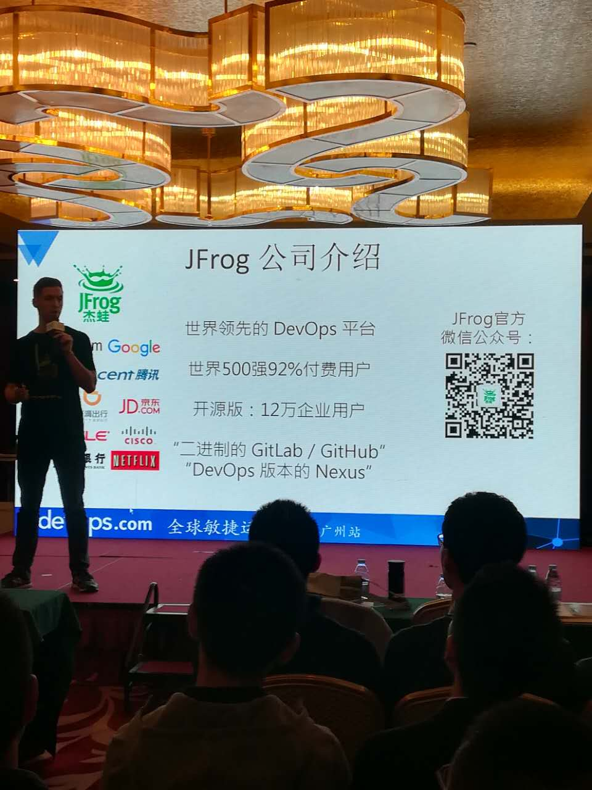
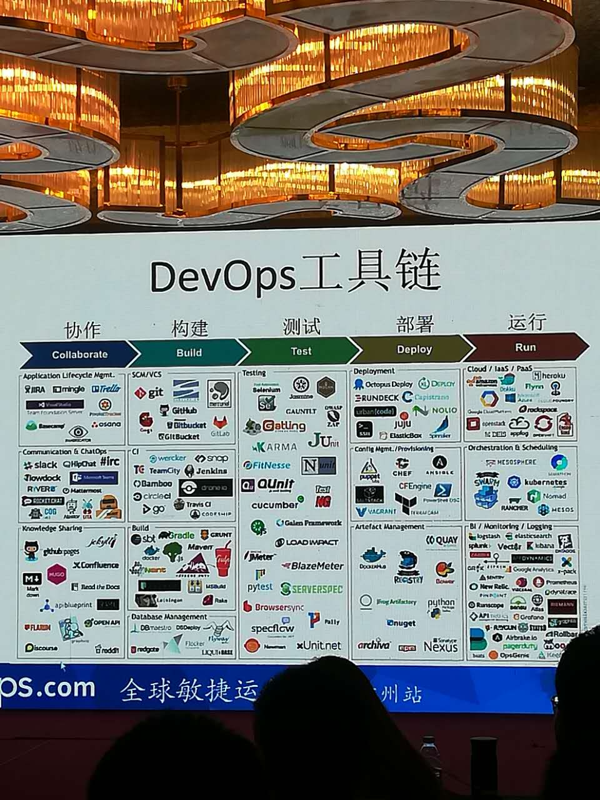
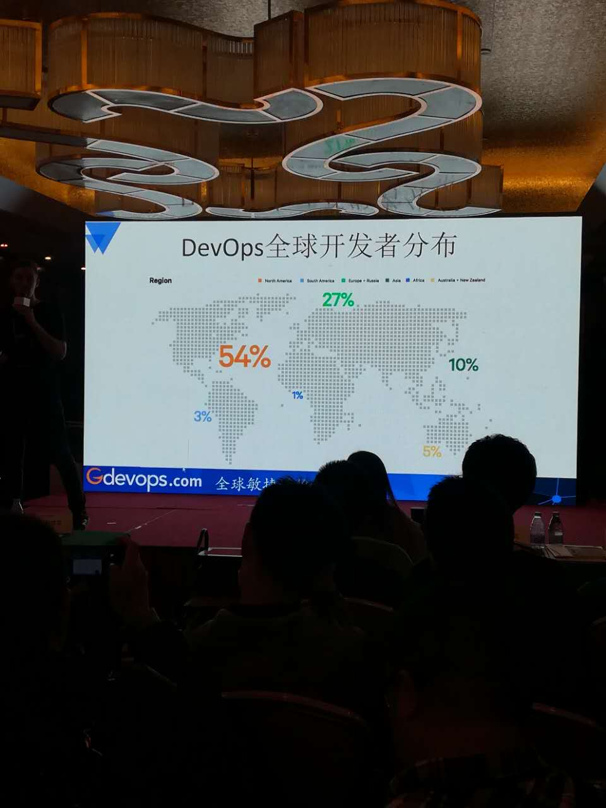
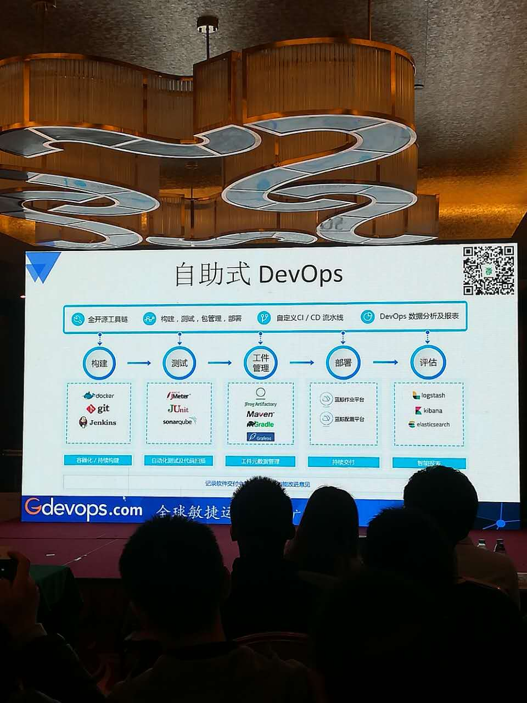
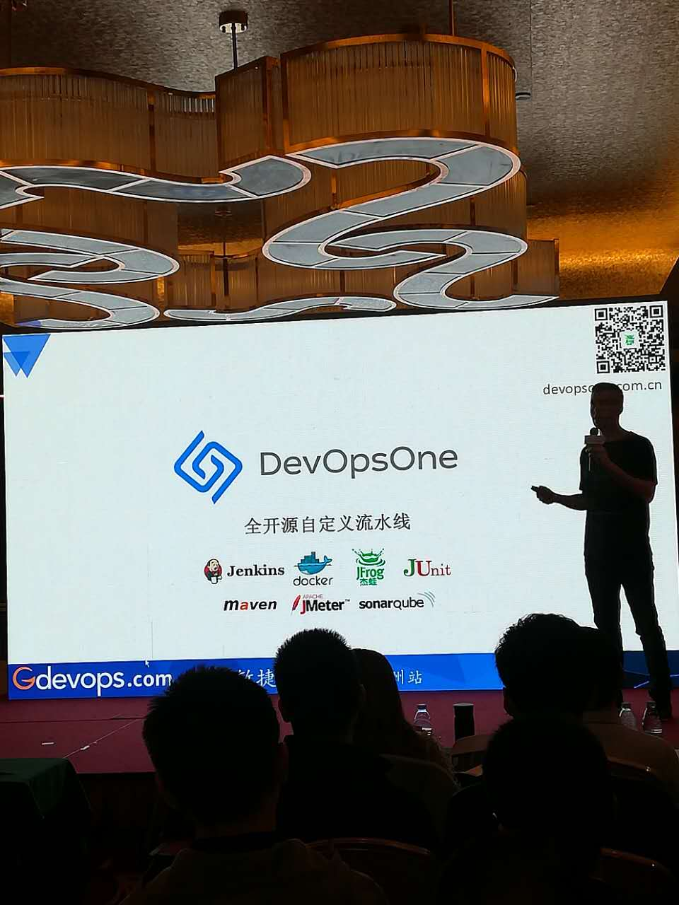
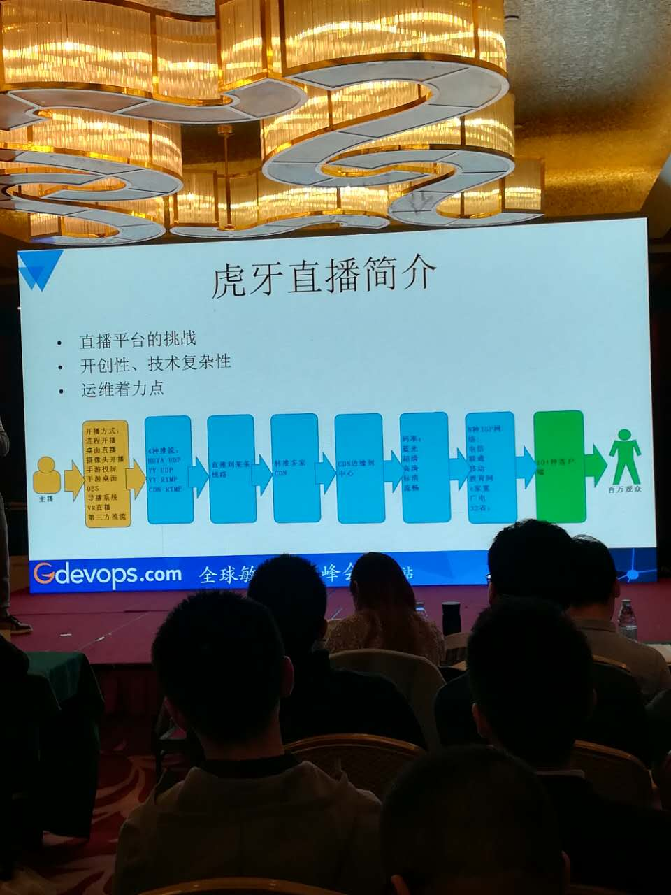
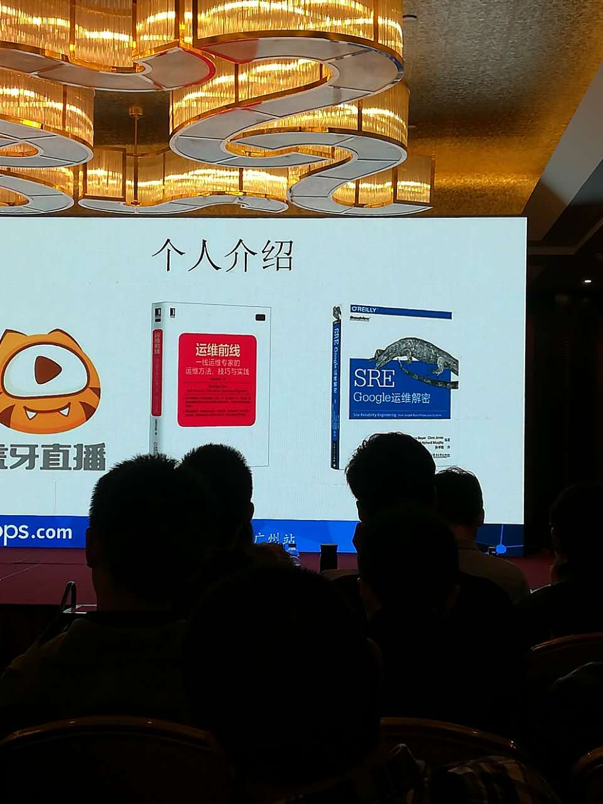
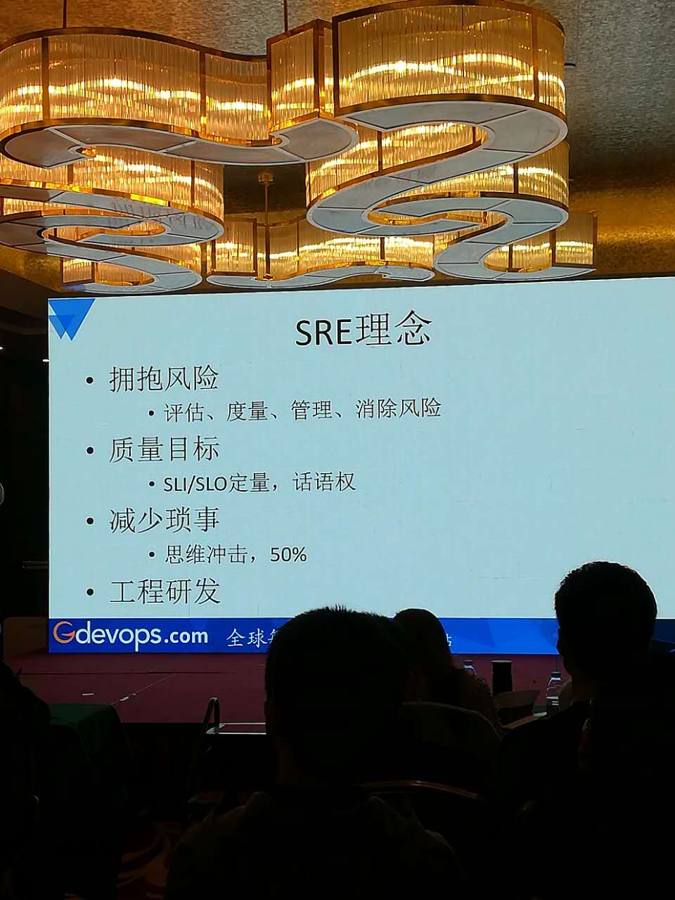
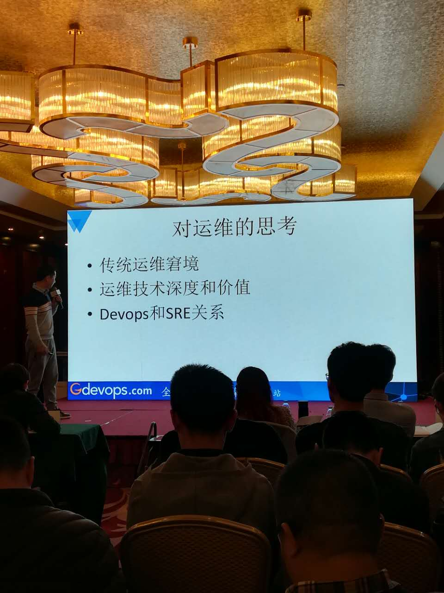
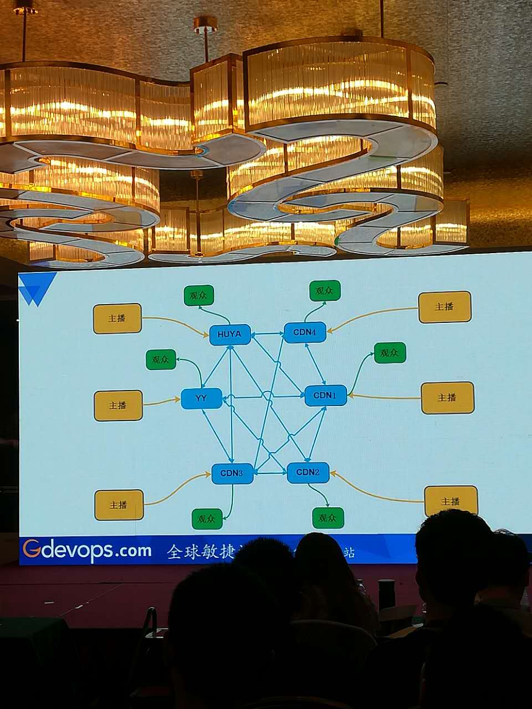

# Gdevops 2017-11-24 全球敏捷运维峰会 广州站（第二届）参会总结

## Gdevops2017 介绍　　  [活动官网](http://gdevops.com/)
全球敏捷运维峰会（Gdevops2017），是国内唯一同时覆盖一线与二线城市的高端技术峰会，在各地均有极大影响力。目前已成功巡回北京、上海、广州、杭州、成都五城，主题覆盖敏捷运维、数据库、云与架构等重点方向。Gdevops峰会汇聚DBAplus社群数百专家资源，是与政府、企业携手打造的敏捷运维领域标杆盛会，全面覆盖从DBA、运维工程师到CXO等所有技术圈层、从互联网、电信、金融、交通到物流等重点行业，在业界、媒体界具有极大影响力。

## Gdevops2017   [官方总结](http://mp.weixin.qq.com/s?__biz=MzI4NTA1MDEwNg==&mid=2650764213&idx=1&sn=56cf6a0bac6a75f19a8e13b5e1c336a1&chksm=f3f9c620c48e4f36bbeb09709d7a674ca5c276911bfb224b28c69b544f4fe7aeabec78c50881&mpshare=1&scene=1&srcid=1126FzW5PxwM8PuXojql79Sy#rd)

- [广州站PPT](https://pan.baidu.com/s/1mi3jRHe#list/path=%2F)  [北京站PPT](https://pan.baidu.com/s/1pKEoWFD#list/path=%2F)

- [上海站PPT](https://pan.baidu.com/s/1c2epJEg)    [成都站PPT](https://pan.baidu.com/s/1jIHqqDw#list/path=%2F)  
- [2016年广州站PPT](https://pan.baidu.com/s/1nvCnY3J)

## Linux中国创始人-王兴宇 企业的开源战略

## 黑客户文化的胜利 
- 商业软件模式
从软件诞生的那一刻起，源码代码本身就是可以随意拷贝和复制的。软件和硬件经过一定的发展形成了分工，以微软为首的商业软件分销模式主导了软件行业的经济模式.

- 古典黑客文化
认为软件应该是自由的，应该是可以互相分享的、交流的，可以促进行业的发展，充满了人文主义精神，以Unix和Linux为代表，兴趣了自由软件、开源软件运动，并形成了一种独特的组织文化（黑客们建设，而骇客们破坏，骇客不能代表主流的黑客文化）

- 互联网的发展
开源文化发展进入主流，在这段洪流中最成功最具代表的公司一定是Google。在互联网发展的背后是技术的长期发展，在这背后开源项目的贡献犹为重要，没有这种分享、交流不可能有这么迅猛的发展。移动互联网到万物互联，数据越来越多，越来越难处理，大数据、云计算、AI也迅速发展

- 影响了软件开发方式
从黑客文化到极客精神，使得我们重新认识了软件开发，敏捷精益思想成为了知识创造型企业的方法论，升级了科技企业管理方法：自组织，黑客、极客这类群体都是极具创造力的，不希望被一堆不懂技术的人管理和指挥，本身开源项目的开发过程也是自组织的，是由个人兴趣而驱动的，这也是符合人的本性的，人天生都是充满好奇心的，是希望探索这个世界，以实现自我价值，来表达我是有价值的

## 企业开源实践

### 规划开源计划
确定开源的目的，开源是一种战略而不是战术
### 执行：落实人员和部门
有具体的岗位和部门去执行.更大层面：开源技术委员会，关注 技术、人力、法律、公关、行政
### 开源要先从内部做起来
- 代码开发和存放
- 代码整理和文档化
- 开源前的审核
- 开源宣告
- 接受反馈建立反馈渠道
### 走向外部社区
- 建立外部社区（如Github）
- 建立线下沙龙（奖励和鼓励）
- 路演开源项目（大型活动、宣讲）
### 形成开源和开放平台生态
对开源项目形成ALM生命周期管理，开源用户也是用户

- 扩展阅读
 [黑客文化WIKI](http://wiki.mbalib.com/wiki/%E9%BB%91%E5%AE%A2%E6%96%87%E5%8C%96)  　　   [黑客文化简史](http://www.linuxsong.org/2010/09/hacker-history/)

## George Hurn-Maloney  Jfrog 一站式软件交付:  世界五百强企业中的DevOps转型之道

DevOps 开发者， 在中国只有10%，说明是一个非常有潜力的岗位

## 虎牙（YY）直播的业务运维修炼实战技

[书籍：SRE: Google运维解密](https://book.douban.com/subject/26875239/)
大型软件系统生命周期的绝大部分都处于“使用”阶段，而非“设计”或“实现”阶段。那么为什么我们却总是认为软件工程应该首要关注设计和实现呢？在《SRE：Google运维解密》中，Google SRE的关键成员解释了他们是如何对软件进行生命周期的整体性关注的，以及为什么这样做能够帮助Google成功地构建、部署、监控和运维世界上现存最大的软件系统。通过阅读《SRE：Google运维解密》，读者可以学习到Google工程师在提高系统部署规模、改进可靠性和资源利用效率方面的指导思想与具体实践——这些都是可以立即直接应用的宝贵经验。

- 问题：DevOps、SRE、ITSM 之间是什么关系？

